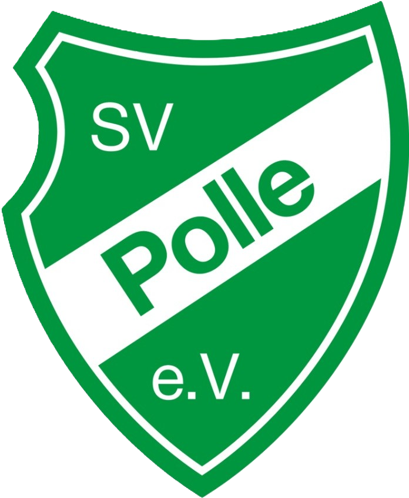

# SV Polle Website

## Über SV Polle
Die Website des SV Polle dient als digitale Präsenz des Sportvereins und soll Mitgliedern, potenziellen Mitgliedern und Interessenten aktuelle Informationen und Services bieten.

## Zielgruppe
- Aktuelle Vereinsmitglieder
- Potenzielle neue Mitglieder
- Sportinteressierte aus der Region
- Eltern von Kindern/Jugendlichen
- Sponsoren und Partner
- Zuschauer und Fans

## Kernfunktionen

### Homepage
- Hero-Section mit Willkommensnachricht
- Kurze Vereinsvorstellung
- Responsive Design für alle Geräte
- Social Media Verlinkungen

### Sportabteilungen
- Detaillierte Informationen zu Fußball
- Informationen zum Dartverein
- Übersicht weiterer Sportangebote (z.B. Yoga)

### Vereinsinformationen
- Geschichte des Vereins
- Ansprechpartner
- Mitgliedsbeiträge
- Satzung und Ordnungen
- Downloadbereich für Formulare
- Links zu sozialen Medien
- Zugang zur geschlossener Whatsapp-Gruppe nach Beitritt
- In der Whatsapp-Gruppe werden aktuelle Informationen und Neuigkeiten geteilt
- Online-Mitgliedsantrag
- Sponsoring-Möglichkeiten

### Mannschaften & Teams
- Übersicht aller in fupa.net gelisteten Mannschaften
- Spielpläne und Ergebnisse
- Tabellen
- Spielerfotos und statische Daten
- Kommende Spiele
- Turniere

### Kontakt & Anfahrt
- Kontaktformular
- Ansprechpartner
- Anfahrtsbeschreibung
- Karte mit Sportstätten
- Soziale Medien Links

## Technische Details

### Framework & Technologie
- Laravel als Backend-Framework
- Svelte für Frontend-Komponenten
- SEO-Optimierung
- Mobile-First Design
- Performanceoptimierung
- DSGVO-Konformität
- Progressive Web App (PWA)
- Push-Benachrichtigungen

### Performance-Ziele
- Ladezeit unter 3 Sekunden
- Mobile PageSpeed Score > 80
- Desktop PageSpeed Score > 90
- 99.9% Verfügbarkeit

### Datenschutz & Sicherheit
- SSL-Verschlüsselung
- DSGVO-konforme Datenspeicherung
- Sichere Formulare
- Cookie-Banner
- Datenschutzerklärung

## Entwicklung

### Phase 1 - Grundfunktionen (MVP)
- Homepage mit Kerninfos
- Responsive Design
- Kontaktmöglichkeit
- Basis-SEO
- Online-Mitgliedsantrag

### Phase 2 - Erweiterung
- Mannschaftsbereich mit FuPa-Integration
- Medienbereich
- Darkmode
- Social Media Integration

### Phase 3 - Integration & Optimierung
- Performance-Optimierung
- Analytics

## Support & Wartung
- Regelmäßige Updates
- Backup-Strategie
- Support-Kontakt
- Dokumentation
- Monitoring-System
- Automatische Backups

## Lizenz
Die SV Polle Website ist urheberrechtlich geschütztes Material.

*Stand: 4. Mai 2025*
